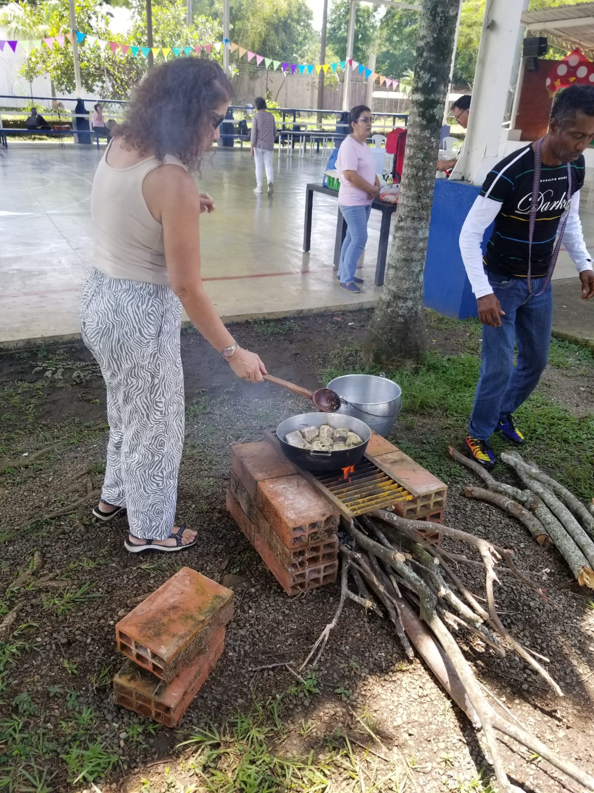
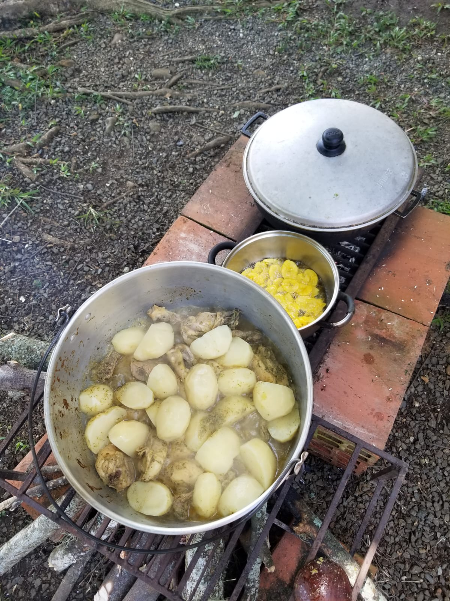
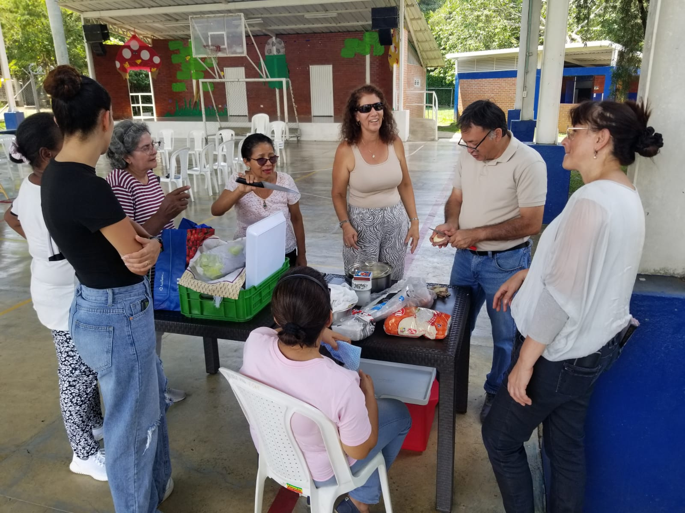
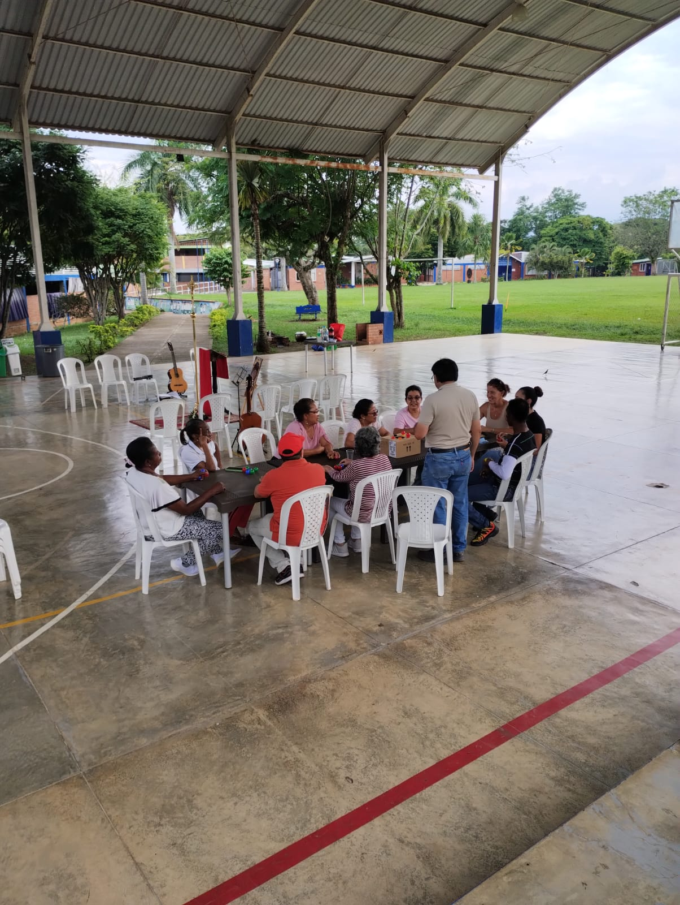
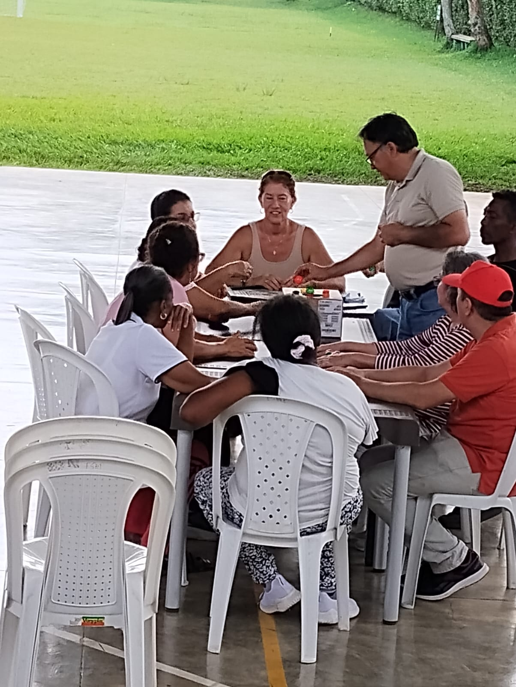

```{r setup, include=FALSE}
knitr::opts_chunk$set(echo = TRUE)
```

</br></br>

```{r, echo=FALSE, out.width="100%", fig.align = "center"}

```

</br></br>

```{r, echo=FALSE, out.width="100%", fig.align = "center"}

```

</br></br>

```{r, echo=FALSE, out.width="100%", fig.align = "center"}

```


</br></br>

```{r, echo=FALSE, out.width="100%", fig.align = "center"}

```

</br></br>

```{r, echo=FALSE, out.width="100%", fig.align = "center"}

```


<center>
<video src="img/c19052024/v1.mp4" type="video/mp4" controls="controls" width="640" height="360"></video>
</center>


<center>
<video src="img/c19052024/v3.mp4" type="video/mp4" controls="controls" width="640" height="360"></video>
</center>


<center>
<video src="img/pentecostes2024/p11.mp4" type="video/mp4" controls="controls" width="640" height="360"></video>
</center>