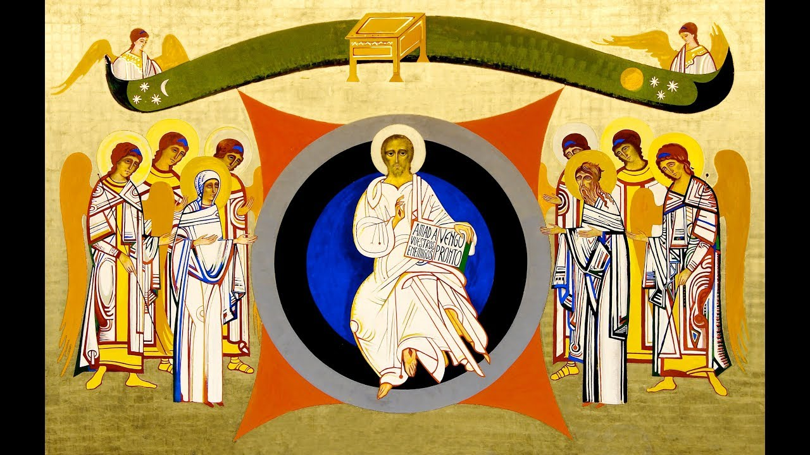

  


```{r setup, include=FALSE}
knitr::opts_chunk$set(echo = TRUE)
```

</br></br>

```{r, echo=FALSE, out.width="100%", fig.align = "center"}

```

</br>

[{width=10%}](https://neocatechumenaleiter.org/cantoral-resucito/)

</br>


### <a href="https://neocatechumenaleiter.org/" target="_blank"><strong>Sitio oficial Camino Neocatecumenal</strong></a>

</br>

### <a href="https://gcatholic.org/calendar/2024/CO-es.htm" target="_blank"><strong>Ordo Católico</strong></a>

</br>

### <a href="https://liturgiadelashoras.github.io/" target="_blank"><strong>Liturgia de las horas</strong></a> 


