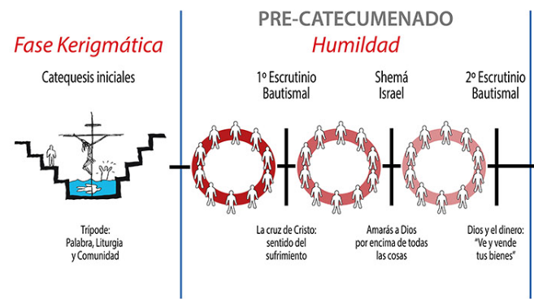

```{r setup, include=FALSE}
knitr::opts_chunk$set(echo = TRUE)
```

</br></br>

* Este es un paso hasta el segundo escrutiio hacia el catecumenado

* Este es un tiempo para ver si queremos ser cristianos

* Todos los esposos(espsas) de las hermanas que no caminan puede venir a la comunidad - Palabra/Eucaristia/Convivencia - Si desean hacer el tripode cuando se realice una conviviencia de Primer escrutinio inscriben su nombre en la BJ

</br>

```{r, echo=FALSE, out.width="60%", fig.align = "center"}

```


</br></br>

Durante este tiempo se preparan temas de la historia de la salvación, para ello se divide la comunidad en grupos

En una bolsa se colocan : Responsables matrimonios:
* Gerardo- Marlene
* Daniel - Adriana
* Oneida
* Jhon Michel (Miroslava)

En una segunda bolsa, el resto de los hermanos

Conformados los grupos, cada uno de ellos tiene dos (2) meses para realizar la preparación, para lo cual se reunen de forma continua y realizan la entrega en un mes (4 martes)

</br></br>

### Cómo hacer la preparación y entrega del tema

* **Se prepara de la Biblia de Jerusalen**
* Si es necesario nos podemos apoyar en materiales como el Diccionario Leon Defour, Catesismo, Libros 
* Es necesario determinar donde empieza el tema y donde termina
* Se realizan todas las lecturas de corrido
* En una de las reuniones de preparación se escogen las lecturas, se proclaman, se realizan ecos y se debinen las noniciones

</br></br>

### Primera noche

Presentación del tema

* Se leligen entre 5 a 7 lecturas, **todas de la biblia**
* Preferiblemente la última lectura sea un evangelio - pueden ser todos evangelios o la última una carta -
* Estas lecturas son selecionadas en una noche de preparación del grupo

* Se prepara la asamblea con : cruz, florero, atril, biblia grande de jerusalen
* Presentación del tema:
  * Monición ambiental
  * Monición / Lectura / Canto
  * No se hace ecos
  * Oraciones
  * Padre Nuestro
  * Saludo de paz
  * Bendición final

</br>

### Nota: 

Debido a que se termina tarde, se autorizó hacer una buena monición inicial y lecturas solamente  (sin moniciones, ni catos)  

</br></br>

###  Segunda noche

* Se realiza una catequesis sobre el tema
*  Se divide el tema en partes = número de catequesis = número de integrantes de grupo
* 10 minutos cada uno - todo oral -  no fichas, ni ayudas, ni resumenes
* No hay lugar para que ninguno no de catequesis - se pide poder del Espiritu Santo
* Se prepara asamblea : cruz, florero, sin atril
* Celebración :
  * Oracion inicial
  * Invocación al Espiriru Santo
  * Catequesis
  * Oraciones / Padre Nuestros / Saludo de Paz / Bendición final
  * Se socializa los grupos correspondientes a la tercera noche

</br></br>

### Tercera noche

* Celebrción doméstica

* Se divide la comunidad en grupos - los matrimonios no se dividen - se meten los nombres de los hermanos que conforman el grupo que entrega en una bolsa y el resto en otra bolsa. Se saca un integrante del primer grupo (grupo que entrega) y luego se completa el grupo con los hermanos contenidos en la segunda bolsa. - esta conformación se comunica al finalizar la segunda noche.

* Cada integrante del grupo que entrega se a casa con un grupo para hacer una encuesta 

* Encuesta: Consta de tres (3) preguntas que salen de la preparación del tema realizada durante los dos (2) meses. Cada pregunta puede tener una cita de apoyo al final de la lectuta de la pregunta

* Cada integrante del grupo que entrega se reune en casa a las 7:00 pm

* Celebración en casa
  * Invocación al Espiritu Santo - dueño de casa
  * Oración
  * Se lee primera pregunta - se lee la cita de apoyo ... se da tiempo corto - 
  * Cada hermano responde a la pregunta, haciendo referencia a la vida 
    .... segunda pregunta   ... tercera pregunta
  * Oraciones / Padre Nuestro / Saludo de Paz / Bendición
  * Compartir si se quiere
  
  No hay cantos
  Mantel blanco en la mesa

</br></br>

### Cuarta noche
  
  * Celebración de palabra normal
  * El grupo con base en las respuestas de la tercera noche prepara la palabra
  * Se escogen : historico / profético / carta / evangelio
  
  * Celebración
    * Monición ambiental
    * Monicion - lectura - canto
    * Ecos
    * Oraciones - antes de las oraciones responsable hace una oración por los hermanos que no han podido asistir a la celebración - se leen de la Biblia Grande de Jerusalen 
    * Saludo de Paz 
    * Bendición final

</br></br>

### Convivencia cierre de tema

* El equipo que entrega prepara la conviviencia, de acuerdo al Ordo determina la semana correspondiente para lo laudes
* Escoge la lectura de la preparación  
* Reserva sitio para la conviviencia
* Todos los hermanos llevamos la biblia de Jerusalen, lapiz y cuaderno

* Celebración
  * Monición ambiental - a cargo del grupo que entrega
  * Oración
  * Laudes - salmos cantados o proclamados
  * Benedictus / Oraciones / Paz / Bendición
  
* Se continua normalmente con el resto de la conviviencia....

* Al cierre de la convivencia se selecciona el siguente grupo para que prepare el siguente tema, entre los hermanos que no se encuentran ni entregando , ni preparando

* Dado que la comunidad es pequeña, para la conformación de los grupos a cargo de las celebraciones de los sábados participan todos los hermanos expto los que empiezan a entregar.

</br></br>

### Notas  finales

* El grupo que prepara envia  lectuaras al responsable de los proclamadores - Daniel
* Tambien envia las leturas al responsalbe de los salmistas (solo cuarta noche)- Carlos Alberto -


    
  
  


Nota:

Si algun hermano no hace el tripode pasa a la segunda comunidad, en caso de que sean muchos, se disuelve la comunidad


