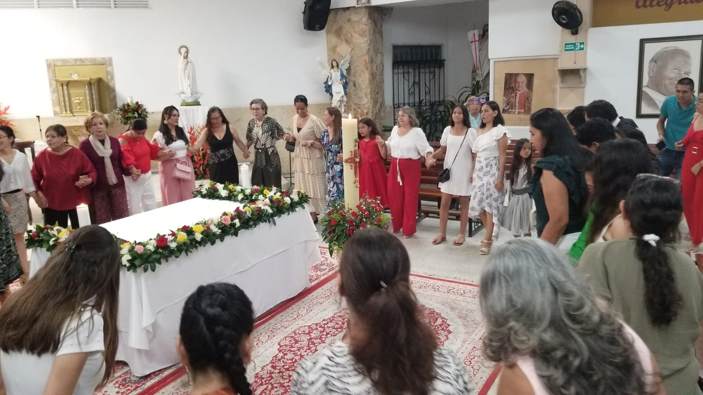

```{r setup, include=FALSE}
knitr::opts_chunk$set(echo = TRUE)
```

</br></br>


```{r, echo=FALSE, out.width="100%", fig.align = "center"}

```

</br></br>


```{r, echo=FALSE, out.width="100%", fig.align = "center"}

```

</br></br>


```{r, echo=FALSE, out.width="100%", fig.align = "center"}

```

</br></br>


```{r, echo=FALSE, out.width="100%", fig.align = "center"}

```
</br></br>

```{r, echo=FALSE}
 # mp4_file <- "img/pentecostes2024/p00.mp4"
 # cat(sprintf('<video src="%s" type="video/mp4" controls="controls" width="640" height="360"></video>', mp4_file))
```

<center>
<video src="img/pentecostes2024/p11.mp4" type="video/mp4" controls="controls" width="640" height="360"></video>
</center>

