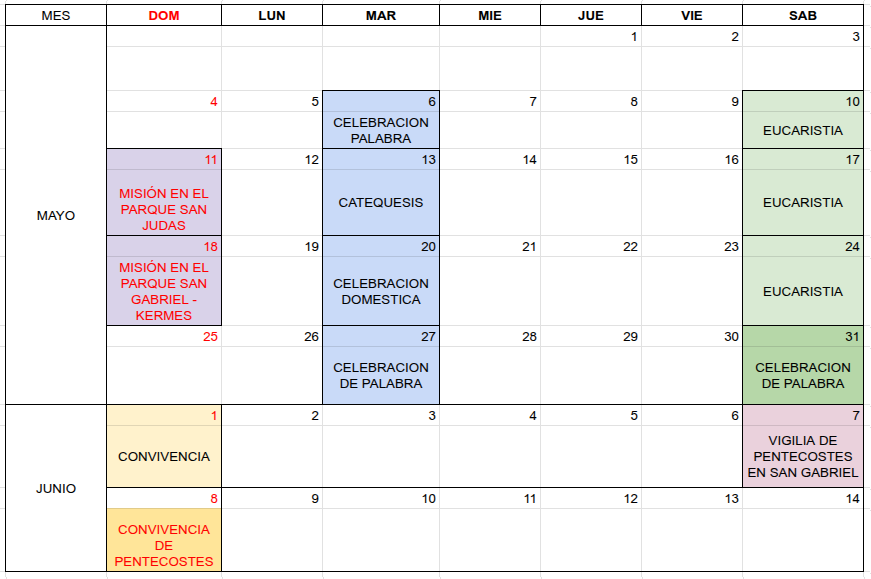

```{r setup, include=FALSE}
knitr::opts_chunk$set(echo = TRUE)
```


## **Próximas celebraciones**

</br></br>

```{r, echo=FALSE, out.width="70%", fig.align = "center"}

```


</br></br>


### **Celebración de Eucaristía**

* Fecha: Sábado 10 de mayo
* Hora : 7:00 pm
* Grupo que prepara: Carlos Alberto, Carmen Edith, Maruja y Miroslava
* Flores: Carmen Zoraida
* Pan : Adriana

</br></br>

### **Misión en el parque San Judas**

* Fecha : Domingo 11 de mayo
* Hora: 11:00 am
* Dirección : Calle 23 entre carrera 49A y carrera 50.


</br></br>

### **Catequesis**

* Fecha : Martes 13 de mayo
* Hora : 7:00 pm
* Tema : La Iglesia de Constantino hasta el concilio de Trento .

</br></br>

### **Celebración de Eucaristía**

* Fecha: Domingo 17 de mayo
* Hora : 7:00 pm
* Grupo que prepara: Yolanda, Gerardo, Marlene, Maria Graciela, Amparo, Karen. 
* Flores: Adriana 
* Pan : Oneida

</br></br>

### **Misión en el parque San Gabriel**

* Fecha : Domingo 18 de mayo
* Responsables : Daniel, Adriana

</br>

### **Kermes**

* Fecha : Domingo 18 de mayo
* Responsables : Gina, Gerardo, Marlene, Oneida


</br></br>

### **Celebración doméstica**

* Fecha : Martes 20 de mayo
* Hora : 7:00 pm
* Tema : La Iglesia de Constantino hasta el concilio de Trento .

</br></br>

### **Celebración de Eucaristía**

* Fecha: Domingo 24 de mayo 
* Hora : 7:00 pm
* Grupo que prepara: Daniel, Adriana, Marlene Asprilla, Maria del Carmen, Tomas.
* Flores: Carmen Zoraida
* Pan : Adriana

</br></br>

### **Celebración de Palabra**

* Fecha : Martes 27 de mayo
* Hora : 7:00 pm
* Tema : La Iglesia de Constantino hasta el concilio de Trento 


</br></br>


### **Celebración de Palabra-Eucaristía**

* Fecha: Sábado 31 de mayo
* Hora : 7:00 pm
* Grupo que prepara: Jhon Michel, Miroslava, Daniel, Adriana, Gerardo, Marlene.
* Flores: Adriana


</br></br>


### **Convivencia cierre tema **

* Fecha: Domingo 01 de junio
* Hora : 10 am

</br></br>


### **Vigilia de Pentecostes**

* Fecha: Sábado 7 de junio
* Hora : 7:00 pm
* Lugar : Parroquia de San Gabriel
* Flores: Adriana y Carmen Zoraida
* Pan : Oneida y Daniel

</br></br>

### **Convivencia de Pentecostes**

* Fecha: Domingo 8 de junio
* Lugar por definir


