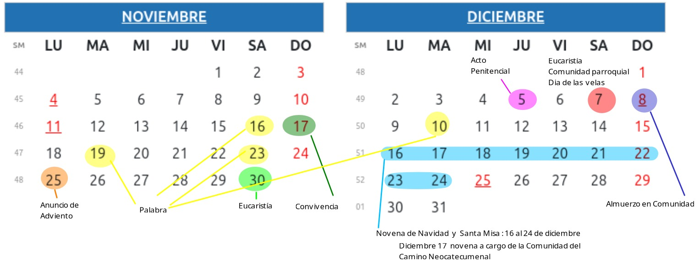

```{r setup, include=FALSE}
knitr::opts_chunk$set(echo = TRUE)
```


##### **Próximas celebraciones**

```{r, echo=FALSE, out.width="100%", fig.align = "center"}

```


#### **Celebración de Palabra** 
* Palabra : **Libertad**
* Fecha: Martes 19 de noviembre
* Hora : 7:00 pm
* Grupo que prepara: Marlene, Oneida, Carlos Alberto, Maruja, Yolanda


<br><br>

#### **Celebración de Palabra-Eucaristía**
* Fecha : Sábado 23 de noviembre 
* Hora : 7:00 pm
* Grupo que prepara : Maria del Carmen, Gerardo, Marleny, Amparo, Daniel, Adriana
 
 
  <br><br>

#### **Anuncio de Adviento**
* Fecha: Lunes 25 de noviembre
* **Hora: 7:30 pm**

 
 
 <br><br>
 
#### **Celebración de Eucaristía**
* Fecha : 30 de noviembre 
* Hora: 7:00 pm
* Grupo que prepara: Carlos Hernan, Zoraida, Miroslava, Carmen Zoraida, Tomas, Carmen Edith

 <br><br>
 
#### **Acto Penitencial**
* Fecha: Jueves 5 de diciembre
* Hora: 7:00 pm
* Grupo que prepara : Equipo de responsables


 <br><br>
 
####  **Eucaristía Conunidad Parroquial -Dia de las velitas**
* Hora: 6:00 pm

  <br><br>
  
#### **Almuerzo en Comuniad**
* Lugar por definir
  
 <br><br>

 
#### **Celebración de Palabra**
* Palabra: **Sangre**
* Fecha: Martes 10 de diciembre
* Hora : 7:00 pm
* Grupo que prepara: Jhon Michel, Karen, Maria Graciela, Carlos Alberto, Tomas, Carlos Hernan, Zoraida, Gerardo, Marleny


 <br><br>

#### **Novena de Navidady Santa Misa**
* Fechas: del 16 al 24 de diciembre
* Novena a cargo de la comunodad del Camino : 17 de diciembre

 <br><br>
 
 
 <!-- * Fecha: octubre 26 -->
<!-- * Grupo: Maria Graciela, Miroslava, Tomás, Yolanda, Carmen Zoraida -->
<!-- * Hora : 7:00 pm -->

<!-- </br> -->

<!-- * Fecha: noviembre 2 -->
<!-- * Grupo: Carlos Alberto, Gerardo, Marleny, Daniel, Adriana, Jhon Michel -->
<!-- * Hora : 7:00 pm -->

<!-- </br> -->


<!-- * Fecha: noviembre 9 -->
<!-- * Grupo: Maria del Carmen, Karen, Carmen Edith, Miroslava, Carmen Zoraida, Yolanda -->
<!-- * Hora : 7:00 pm -->

<!-- </br> -->


<!-- * Fecha: noviembre 16 -->
<!-- * Grupo: Carlos Alberto, Carmen Edith, Jhon Michel, Maria Graciela, Daniel, Adriana, Gerardo, Marlene -->
<!-- * Hora : 7:00 pm -->

<!-- </br> -->


<!-- * Fecha : septiembe 21 -->
<!-- * Grupo : Yolanda, María del Carmen, Amparo, Carmen Edith, Gerardo, Marlene -->


<!-- * Fecha : septiembre 28 -->
<!-- * Grupo : Carlos Hernan, Zoraida, Marlene, Oneida, María Graciela, Carmen Zoraida -->

<!-- </br> -->


<!-- * Fecha : octubre 5 -->
<!-- * Grupo : Miroslava, Jhon Michel, Karen, Maruja, Marlene, Amparo -->

<!-- </br> -->


<!-- * Fecha : octubre 12  -->
<!-- * Grupo : Carmen Zoraida, Yolanda, Carlos Hernan, Zoraida, Oneida, Carmen Edith -->

<!-- </br> -->


<!-- * Fecha :  agosto 24 -->
<!-- * Grupo : Carmen Edith, Carlos Hernan, Zoraida, Miroslava, Marlene -->

<!-- </br> -->

<!-- * Fecha :  agosto 31 -->
<!-- * Grupo : Tomas,  Jhon Michel, Carlos Alberto, Karen, Maruja -->

<!-- </br> -->


<!-- * Fecha :  septiembre 7  -->
<!-- * Grupo :  Oneida, Amparo, Daniel, Adriana -->

<!-- </br> -->

<!-- * Fecha : septiembre 14 -->
<!-- * Grupo : Marial del Carmen, Karen, Marlene, Daniel, Adriana -->


<!-- * Fecha:  Julio 20 -->
<!-- * Grupo : Miroslava, Daniel-Adriana, Gerardo-Marlene -->

<!-- </br> -->

<!-- * Fecha: Julio 27 -->
<!-- * Grupo: Carlos Hernan- Zoraida, Marlene, Jhon Michel, Carmen Zoraida, Yolanda -->

<!-- </br> -->

<!-- * Fecha: Agosto 3 -->
<!-- * Grupo: Carmen Edith, Maria del Carmen, Tomas, Carlos Alberto -->

<!-- </br> -->

<!-- * Fecha: Agosto 10 -->
<!-- * Grupo: Yolanda, Maria del Carmen, Carlos Hernan-Zoraida, Gerardo-Marlene, Tomas -->

<!-- </br> -->

**Nota** : 

* En caso de que el padre Germán no nos pueda celebrar, se realiza celebración de Palabra
